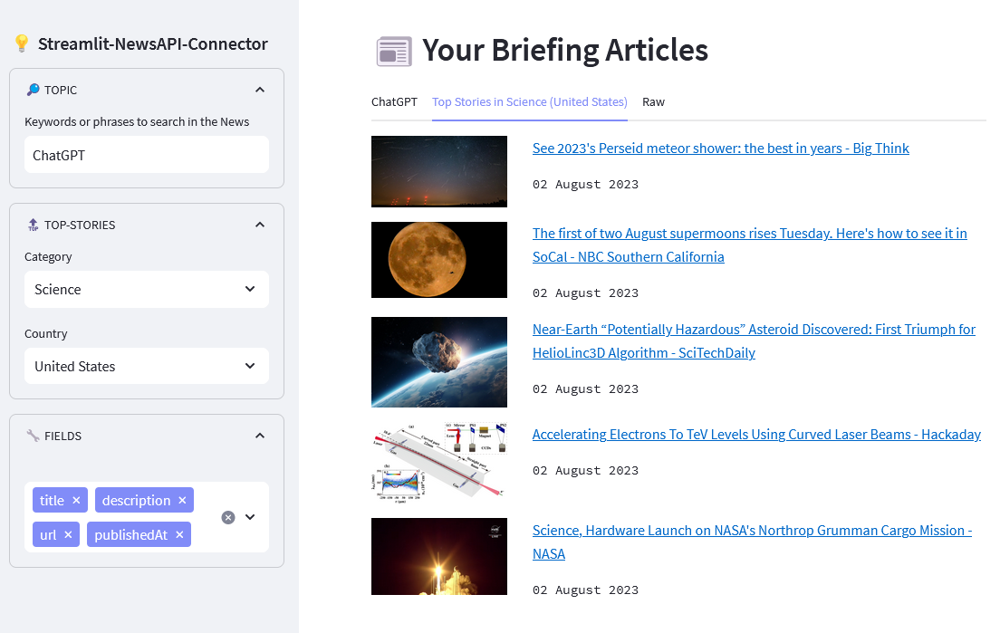

# 📰 Streamlit-NewsAPI Data Connector

Connect to [NewsAPI](https://newsapi.org/) from your Streamlit app. Powered by ```st.experimental_connection()```. Works with Streamlit >= 1.22. Read more about Streamlit Connections in the [official docs](https://blog.streamlit.io/introducing-st-experimental_connection/). 

Contributions to this repo are welcome. If you are interested in helping to maintain it, reach out to us. 

[](https://www.steamlit.io/)
[](https://newsapi.org/)
[](https://newsapi-connector.streamlit.app/)

## 🚀 Quickstart

1. Clone the repository:
```
git clone git@github.com:dcarpintero/st-newsapi-connector.git
```

2. Create and Activate a Virtual Environment:

```
Windows:

py -m venv .venv
.venv\scripts\activate

macOS/Linux

python3 -m venv .venv
source .venv/bin/activate
```

3. Install dependencies:

```
pip install -r requirements.txt
```

4. Launch Web Application

```
streamlit run ./app.py
```

## 📄 Minimal Integration

```python
# src/app.py

import streamlit as st
from newsapi.connection import NewsAPIConnection

conn_newsapi = st.experimental_connection("NewsAPI", type=NewsAPIConnection)

# Retrieves News Articles on a specific topic from the NewsAPI
df = conn_newsapi.everything(topic="ChatGPT")
st.dataframe(df)

# Retrieves Top-Headlines in a country and category from the NewsAPI
df = conn_newsapi.top_headlines(country='US', category='Science')
st.dataframe(df)
```

```toml
# .streamlit/secrets.toml

NEWSAPI_KEY = 'your-newsapi-key'
NEWSAPI_BASE_URL = 'https://newsapi.org/v2/'
```

```txt
# requirements.txt

requests==2.31.0
streamlit==1.25.0
```

## 👩‍💻 Streamlit Web App

Demo Web App deployed to [Streamlit Cloud](https://streamlit.io/cloud) and available at https://newsapi-connector.streamlit.app/ 



## 📚 References

- [Experimental BaseConnection](https://docs.streamlit.io/library/api-reference/connections/st.connections.experimentalbaseconnection)
- [Experimental Connection](https://blog.streamlit.io/introducing-st-experimental_connection/)
- [Get Started with Streamlit Cloud](https://docs.streamlit.io/streamlit-community-cloud/get-started)
- [NewsAPI Dcoumentation](https://newsapi.org/docs)

